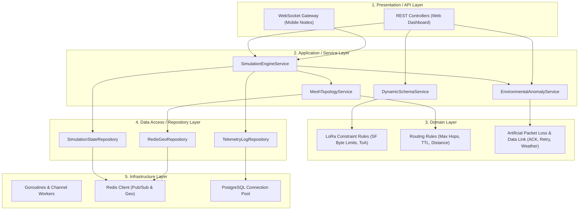

# Product Requirement Document (PRD) - Backend Service
## Maritime LoRa Mesh Network Simulator

---

## 1. Overview & Problem Statement
Pengembangan jaringan komunikasi maritim berbasis perangkat keras LoRa (seperti TTGO ESP32) memiliki risiko tinggi dan biaya iterasi yang mahal jika pengujian topologi dilakukan langsung di laut. Terdapat kebutuhan untuk memvalidasi algoritma *multi-hop routing* (*Mesh*), batas transmisi data (*Spreading Factor limit*), serta ketahanan sistem terhadap gangguan lingkungan (ombak, cuaca) sebelum perangkat keras fisik diproduksi dan di-deploy.

**Backend Simulator Maritim** ini dibangun menggunakan **Go (Golang)** untuk bertindak sebagai *Network Controller*, *Virtual Edge* (Syahbandar), sekaligus *Virtual Environment*. Sistem ini menerima koneksi dari ratusan aplikasi *mobile* (Flutter) yang menyimulasikan diri sebagai *node* LoRa di kapal. Backend bertugas menghitung jarak geospasial secara *real-time*, membentuk topologi *routing table* (misal: Node C -> Node A -> Node B -> Edge), mengelola skema *payload* dinamis, dan mengeksekusi simulasi probabilistik untuk meniru anomali radio fisik (*Artificial Packet Loss*) beserta mekanisme *Data Link* aslinya (*ACK & Retry*).

---

## 2. Goals & Non-Goals

### A. Goals
* **Dynamic Mesh Routing Engine**: Membangun algoritma yang secara periodik menghitung jarak antar *node* menggunakan Redis Geospatial dan me- *broadcast* rute *parent-child* ke setiap aplikasi *mobile*.
* **Dynamic Schema & Configuration**: Menyediakan sistem injeksi skema *payload* (mendefinisikan atribut secara dinamis) dan parameter LoRa (Spreading Factor, TX Power) dari *dashboard* web ke seluruh *node* simulasi.
* **Probabilistic Environment Simulation**: Mengimplementasikan logika *Artificial Packet Loss* berbasis jarak dan konfigurasi "Cuaca/Interferensi" untuk meniru kejadian *multipath fading* dan kerusakan/anomali fisik *chip* SX1276.
* **Store, Forward, ACK & Retry Logic**: Mengimplementasikan logika protokol *MAC/Data Link* nyata pada LoRa. Termasuk mekanisme deduplikasi paket (*Packet ID caching*), pengiriman tanda terima (*Acknowledgement/ACK*), dan kirim ulang otomatis (*Auto-Retry*) jika paket hilang di udara.
* **High-Concurrency WebSocket**: Menjaga koneksi *Full-Duplex* secara persisten dengan seluruh aplikasi *mobile* untuk mensimulasikan transmisi radio dan menerima data biner.

### B. Non-Goals
* Tidak menggunakan *Physics Engine* kelas berat (seperti MATLAB, NS-3, atau OMNeT++) untuk merender simulasi elektromagnetik secara murni; seluruh anomali fisik disimulasikan menggunakan model probabilitas (*pseudo-simulation*).
* Tidak membangun antarmuka visual (UI/UX) untuk *dashboard* pemantauan (ini adalah tanggung jawab proyek Frontend Next.js).
* Tidak mengompilasi kode C++ untuk *firmware* ESP32 di dalam repositori ini.

---

## 3. Detailed Architectural Layers Breakdown

### 3.1. Presentation / API Layer

Layer ini terbagi menjadi dua protokol: REST API untuk konfigurasi dari *Dashboard* (Syahbandar) dan WebSocket untuk komunikasi *real-time* dua arah dengan *Node* (Kapal).

| Protocol | Endpoint / Event | Payload Intention | Keterangan |
| --- | --- | --- | --- |
| `HTTP POST` | `/api/simulations/start` | Parameter SF, batas radius, daftar Edge. | Menginisiasi sesi simulasi baru. |
| `HTTP POST` | `/api/schemas/set` | Skema field JSON (jenis ikan, berat, dll). | Menetapkan struktur data dinamis untuk *payload* mobile. |
| `HTTP POST` | `/api/simulations/weather` | Tingkat keparahan badai (0-100%). | Memicu probabilitas *packet loss* di jaringan. |
| `WS EVENT` | `node:connect` | `node_id`, `lat`, `lng`, `edge_target`. | Registrasi awal *mobile app* ke *Virtual Edge*. |
| `WS EVENT` | `node:telemetry` | *Binary payload* (kompresi data tangkapan). | Ingesti data simulasi dari kapal. |
| `WS EVENT` | `node:ack` | `packet_id`, `status`. | Tanda terima bahwa paket sukses diterima *node* berikutnya. |
| `WS BROADCAST` | `mesh:routing_table` | `[{node: "C", parent: "A"}, {node: "A", parent: "B"}]` | Server mendikte rute ke setiap kapal. |

---

### 3.2. Application / Service Layer

Berisi seluruh logika orkestrasi simulasi tanpa terikat langsung pada basis data.

* **`MeshTopologyService`**:
* Menerima pembaruan koordinat GPS dari semua kapal aktif.
* Menghitung radius antar-*node* berdasarkan TX Power.
* Membentuk *Directed Acyclic Graph* (DAG) untuk menentukan *node* mana yang terdekat dengan Edge, lalu mendistribusikan *routing table* tersebut kembali via WebSocket.

* **`EnvironmentalAnomalyService`**:
* Bertindak sebagai injektor probabilitas (*chaos monkey*). Menilai setiap paket dan sinyal ACK yang melintas berdasarkan jarak pengirim-penerima, lalu memutuskan apakah paket tersebut selamat atau hancur (*drop*) di udara akibat cuaca/ombak.

* **`SimulationEngineService`**:
* Bertindak sebagai "Virtual Ether" (Udara). Menerima *payload* dari Node C, memvalidasinya melalui `EnvironmentalAnomalyService`. Jika lolos, ia meneruskan *payload* ke koneksi WebSocket Node A.
* Memfasilitasi penerusan sinyal **ACK** dari Node A kembali ke Node C.
* Mengatur validasi *Packet ID* menggunakan Redis untuk menolak paket duplikat (deduplikasi) akibat *retry* yang berlebihan.

* **`DynamicSchemaService`**:
* Mendistribusikan definisi form (skema *payload*) yang dibuat dari Web *dashboard* kepada seluruh aplikasi *mobile*.

---

### 3.3. Domain Layer

Mendefinisikan aturan keras (*invariants*) untuk menyimulasikan batasan fisik LoRa dan probabilitas kegagalan di lapangan.

* **LoRa Physical Constraints**:
* Jika SF = 10-12, batas maksimum *payload* simulasi yang masuk adalah **51 bytes**. Jika melanggar = *Drop*.
* Jika SF = 7-9, batas maksimum *payload* adalah **242 bytes**.

* **Mesh Routing Constraints**:
* Batas maksimal lompatan (*Max Hops / TTL*) adalah **5 hop**. Jika paket melampaui batas ini sebelum mencapai Edge = *Drop*.

* **Data Link Constraints (ACK & Retry)**:
* *Half-Duplex Simulation*: Node pengirim harus menunggu sinyal balasan (ACK) dari penerima sebelum melanjutkan tugas lain.
* *Timeout*: Waktu tunggu ACK dikalkulasi secara dinamis bergantung pada nilai SF saat ini (SF tinggi = Timeout lebih lama).
* *Auto-Retry Limit*: Jika Node tidak menerima ACK hingga *timeout*, Node akan mengirim ulang maksimal **3 kali**. Jika tetap gagal, Node mendeklarasikan *link* terputus dan meminta `MeshTopologyService` merancang rute baru.

* **Probabilistic Failure Models (Artificial Packet Loss)**:
* *Base Degradation*: Probabilitas hilangnya paket berbanding lurus dengan jarak antar *node*. (Misal: Jarak < 2 km memiliki probabilitas *loss* 5%, Jarak 2-5 km = 20%, Jarak > 5 km = 60%).
* *Weather Multiplier*: Jika status cuaca diatur ke "Badai", *base degradation* dikalikan dengan faktor pengali (misal 1.5x) untuk menyimulasikan tingginya redaman sinyal dan *multipath fading* akibat ombak besar.

---

### 3.4. Data Access & Infrastructure Layer

* **Redis (In-Memory Database)**:
* *Geospatial*: Menyimpan koordinat setiap kapal dengan latensi sub-milidetik untuk keperluan kalkulasi rute *multi-hop*.
* *Cache*: Menyimpan *state* konfigurasi jaringan (SF saat ini, Cuaca, Skema aktif) dan *key-value* `packet_id` dengan TTL 30 detik untuk deduplikasi.

* **PostgreSQL (Persistent Database)**:
* Menyimpan riwayat hasil simulasi, statistik *packet loss*, statistik keberhasilan *retry*, log *payload* tangkapan ikan yang sukses tiba di Syahbandar, dan master data *Edge*.

* **Gorilla WebSocket**: Infrastruktur *transport* utama untuk mempertahankan ratusan koneksi persisten secara serentak.

---

### 3.5. Cross-Cutting Concerns

* **Observability**: Menyediakan log *console* berformat JSON untuk memantau waktu kalkulasi topologi, siklus *Retry/ACK*, dan memantau persentase paket yang sengaja di-*drop* oleh *EnvironmentalAnomalyService*.
* **Rate Limiting**: Secara opsional membatasi tembakan *update* koordinat GPS dari *mobile* (maksimal 1 *update* per 3 detik per *node*) agar Redis tidak kelebihan beban *write*.

---

## 4. Acceptance Criteria (Done When)

* [ ] Backend Go berhasil menerima koneksi WebSocket dari minimal 50 *node client* secara bersamaan tanpa *memory leak*.
* [ ] Algoritma `MeshTopologyService` terbukti mampu mengidentifikasi dan memetakan rute (misal C -> A -> B -> Edge) berdasarkan proksimitas jarak (*distance calculation*).
* [ ] Perubahan parameter SF dari REST API langsung memicu validasi batas *byte payload* secara *real-time* di seluruh koneksi yang aktif.
* [ ] **Fitur Simulasi Cuaca (`EnvironmentalAnomalyService`) berhasil menginjeksi *drop rate* (paket gagal sampai) secara probabilistik sesuai dengan parameter jarak dan kondisi badai yang dikonfigurasi via API.**
* [ ] **Mekanisme ACK & Auto-Retry berfungsi penuh: *Node* yang paketnya terkena *drop* secara artifisial dapat mendeteksi kegagalan tersebut melalui *timeout* dan berhasil melakukan transmisi ulang (*retry*).**
* [ ] Paket biner yang diteruskan antar-*node* berhasil dibaca utuh di titik akhir (Edge).
* [ ] Paket ganda akibat *retry* sukses disaring dan diabaikan oleh sistem deduplikasi Redis.

---

## 5. Anti-Slop Code & Design Standards (Strict Enforcement)

* **No Placeholder Code**: Backend Go harus ditulis lengkap. Dilarang menggunakan *interface* kosong atau komentar tipe `// implement logic here`.
* **Graceful Concurrency**: Seluruh Goroutine yang menangani WebSocket harus dibungkus dengan *context cancellation* dan *recover* dari *panic* agar kegagalan satu *node* tidak mematikan seluruh server.
* **Binary-First Mindset**: Semua pengolahan data *telemetry mesh* harus diperlakukan sebagai operasi *byte array*, bukan manipulasi *String* atau JSON yang memakan memori tinggi.
