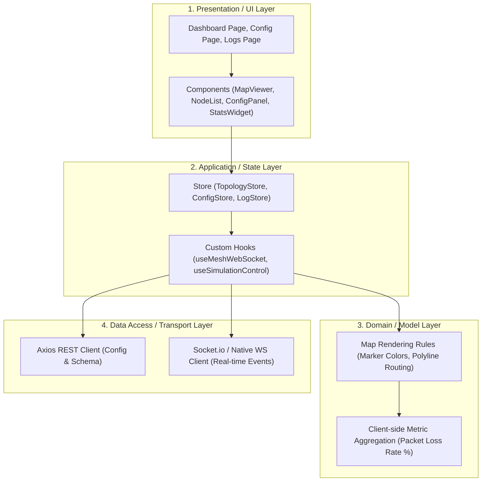

# Product Requirement Document (PRD) - Frontend Service
## Maritime LoRa Mesh Network Simulator

---

## 1. Overview & Problem Statement
Sistem simulasi jaringan LoRa maritim membutuhkan antarmuka visual yang dapat memantau pergerakan *node* (kapal), rute topologi *mesh*, dan statistik transmisi secara *real-time*. Tanpa antarmuka ini, simulasi algoritma *multi-hop* yang berjalan di *backend* Go akan sulit divalidasi dan dianalisis oleh pengguna (Syahbandar/Engineer).

**Frontend Simulator Maritim** ini dibangun menggunakan **Next.js (React)** sebagai *dashboard* pemantauan tunggal (*Single Page Application / Dashboard-oriented*). Frontend bertugas merender peta interaktif yang menampilkan posisi koordinat setiap kapal, menggambar garis rute *mesh* (misal: Node C $\rightarrow$ Node A $\rightarrow$ Node B $\rightarrow$ Edge), dan menyediakan panel kontrol untuk menginjeksi anomali cuaca (*Artificial Packet Loss*) serta mengubah batasan LoRa (Spreading Factor) secara dinamis ke *backend*.

---

## 2. Goals & Non-Goals

### A. Goals
* **Real-Time Topology Visualization**: Memanfaatkan **React-Leaflet** untuk merender posisi kapal (marker) dan garis penghubung rute *mesh* (polylines) yang ter- *update* seketika saat menerima siaran data dari *backend*.
* **High-Frequency State Handling**: Menggunakan **Zustand** untuk mengelola ratusan perubahan *state* per detik (pergerakan *node* dan pembaruan *routing*) tanpa mengorbankan performa *render* UI (menghindari re-render yang tidak perlu seperti pada Redux).
* **Simulation Control Panel**: Menyediakan form interaktif untuk mengonfigurasi parameter *Spreading Factor* (SF), *TX Power*, dan mengatur pemicu badai buatan (*Weather Severity*) via REST API.
* **Dynamic Schema Form Builder**: Menyediakan antarmuka untuk mendefinisikan struktur *payload* (seperti jenis ikan, berat) yang akan diinjeksi ke aplikasi *mobile*.
* **WebSocket Integration**: Menggunakan native WebSocket atau **Socket.io-client** untuk mempertahankan koneksi persisten dengan *backend* Go demi menerima *push event* tanpa jeda *polling*.

### B. Non-Goals
* Tidak menangani komputasi jarak spasial (*Geospatial Calculation*) atau penentuan algoritma rute; semuanya murni diterima dari *backend* Go.
* Tidak berfungsi sebagai aplikasi *mobile* pengirim data tangkapan (ini adalah domain Flutter).
* Tidak berinteraksi langsung dengan database PostgreSQL atau Redis (semua melalui perantara REST API Backend).

---

## 3. Detailed Architectural Layers Breakdown

### 3.1. Presentation / UI Layer

Layer presentasi berfokus pada performa *rendering* komponen pemetaan dan penyajian data statistik yang padat namun bersih (*clean UI*).

* **Views/Pages**:
* *Live Dashboard*: Halaman utama yang berisi kanvas peta layar penuh (*fullscreen map*) di satu sisi, dan panel *log real-time* serta metrik di sisi lainnya.
* *Simulation Setup*: Halaman untuk memulai sesi baru, mengatur parameter LoRa, dan membuat skema *payload* dinamis.
* *Historical Reports*: Tabel rekam jejak paket yang berhasil sampai ke Syahbandar.

* **Shared Components**:
* `MapViewer`: Komponen pembungkus React-Leaflet yang menginisiasi *basemap* (misal: OpenStreetMap/Mapbox).
* `NodeMarker`: Titik kapal di peta. Berubah warna (misal: Hijau = Terhubung, Merah = *Isolated*, Kuning = *Retrying*).
* `MeshPolyline`: Garis dinamis yang menghubungkan antar *marker* berdasarkan *Routing Table*.
* `ControlWidget`: Kartu panel untuk memicu "Cuaca Badai" secara instan.

---

### 3.2. Application / State Layer

Zustand memegang peran krusial di sini untuk memastikan peta tidak *lag* ketika ada 50+ kapal yang bergerak dan memperbarui rutenya secara simultan.

* **Global State (Zustand)**:
* `TopologyStore`: Menyimpan *Map/Dictionary* dari semua `node` aktif beserta posisinya (lat/lng) dan referensi `parent_id` mereka.
* `SimulationStore`: Menyimpan status *session* saat ini (ID sesi, SF aktif, tingkat cuaca).
* `MetricStore`: Menyimpan *counter* untuk total paket terkirim, paket gagal (*dropped*), dan paket *retry*.

* **Custom React Hooks**:
* `useMeshWebSocket(sessionId)`:
* Membuka koneksi WebSocket ke Go.
* Mendengarkan event `mesh:routing_update` dan memodifikasi `TopologyStore`.
* Mendengarkan event `node:ping` untuk menggeser koordinat `NodeMarker`.

* `useSimulationControl()`: Menyediakan fungsi abstrak pembungkus Axios untuk memanggil `/api/simulations/weather` atau mengubah SF.

---

### 3.3. Domain / Model Layer

Aturan representasi visual dan agregasi data ringan di sisi *browser*.

* **Topology Rendering Rules**:
* Jika Node A memiliki `parent: Node B`, komponen peta harus menggambar *Polyline* berarah (dengan panah) dari kordinat A ke koordinat B.
* Jika Node kehilangan `parent` (status *Isolated*), garis dihapus dan *marker* berubah menjadi warna merah terang (`#EF4444`).

* **Telemetry Overlay**:
* Saat *marker* kapal diklik, muncul *popup* Leaflet yang menampilkan isi `decoded_payload` (contoh: Jenis Ikan, Berat) yang terakhir kali dikirimkan.

---

### 3.4. Data Access / Transport Layer

Mengatur dua jalur komunikasi yang berbeda dengan backend Go.

* **REST API (Axios)**:
* Digunakan murni untuk operasi transaksional satu arah yang tidak membutuhkan pembaruan instan terus-menerus (contoh: Inisiasi *Session*, Submit Skema JSON, Trigger Cuaca).

* **WebSocket Engine**:
* Digunakan murni untuk *read-only real-time ingestion* di sisi *frontend* (kecuali jika ada kebutuhan spesifik *admin broadcast*).
* Secara otomatis mencoba menghubungkan ulang (*auto-reconnect*) jika *backend* Go direstart.

---

### 3.5. Cross-Cutting Concerns

* **Performance / Re-rendering**: Penggunaan pola *selector* pada Zustand diwajibkan (misal: `useStore(state => state.nodes[id])`) agar pergerakan Node A tidak memicu render ulang pada komponen Node B.
* **Map Tile Performance**: *Tiles* peta Leaflet harus dicache dengan baik, dan batas *zoom* ditetapkan agar komponen *canvas* peta tidak membebani memori peramban (*browser*).

---

## 4. Acceptance Criteria (Done When)

* [ ] Proyek Next.js (App Router/Pages Router) dan dependensi Zustand serta React-Leaflet sukses diinisialisasi.
* [ ] Halaman *Dashboard* mampu menampilkan >50 titik kapal yang bergerak mulus di atas peta tanpa *lag* visual yang signifikan.
* [ ] Perubahan rute dari *backend* Go (`mesh:routing_update`) otomatis menggambar ulang garis *Polyline* di layar dalam waktu < 500ms.
* [ ] Form injeksi cuaca (Badai) sukses mengirim *payload* REST API ke Go dan memperbarui label status cuaca di antarmuka.
* [ ] Komponen visual dengan jelas membedakan mana *node* yang terhubung ke jaringan dan mana yang terisolasi.

---

## 5. Anti-Slop Code & Design Standards (Strict Enforcement)

* **No Placeholder / Dummy Data Delay**: Jangan mem- *hardcode* pergerakan kapal menggunakan `setInterval` statis di komponen UI. Data *mock* hanya boleh berada di level Transport Layer (Service) jika *backend* belum siap, sehingga komponen UI tetap bersih dan *data-driven*.
* **Decoupled Map Logic**: Logika kalkulasi React-Leaflet harus dipisahkan ke dalam komponen kecil yang mandiri, dilarang menumpuk seluruh *state* dan *render logic* peta di dalam satu file `page.tsx` yang masif.
* **Clean WebSocket Lifecycle**: Seluruh *listener* WebSocket wajib memiliki *cleanup function* (misal: `socket.off()` atau `ws.close()`) saat komponen *unmount* (keluar dari halaman) untuk mencegah kebocoran memori (*memory leak*).